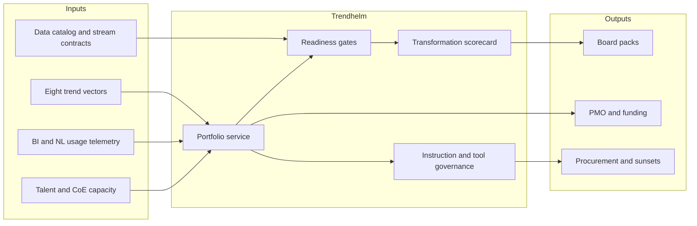

# Trendhelm

**Source:** `ai-in-enterprise/Enterprise-Analytics-Trends-to-Watch-in-2018/`
**Domain:** `ai-enterprise`
**One-liner:** An analytics transformation operating system that turns the eight “intelligent enterprise” trends into a governed portfolio of initiatives, adoption gates, and insight streams so CIOs and CDOs can close the two-year digital survival window with measurable outcomes.
**Wedge:** Fortune 1000 / large mid-market enterprises where the CDO or Head of BI owns a fragmented analytics stack (self-service BI + data lakes + point AI tools) and must publish a 12–24 month intelligent-enterprise roadmap the board can fund.
**Positioning:** Analytics trend operating system. BI vendors sell another dashboard; Trendhelm sells the operating agenda—conversational and augmented analytics, real-time/batch fusion, talent and governance, edge/video, and access-vs-ownership of insight streams—as a single portfolio with KPIs, owners, and kill criteria.

## Market research synthesis

### Thesis from source

The MicroStrategy 2018 trends brief frames analytics not as a tooling refresh but as a race to become an “Intelligent Enterprise” under Digital Darwinism. It cites a survey finding that **85% of enterprise decision makers** believe they have only about **two years** to make significant digital-transformation inroads before suffering financially or falling behind competitors. The Intelligent Enterprise must connect to any data, distribute insight to thousands, and go beyond classic BI into every department, device, and constituent.

Eight concrete pressures define the agenda. Forrester’s Boris Evelson and Michele Goetz argue that lift-and-shift is insufficient: roughly a **quarter of firms** will supplement point-and-click analytics with conversational interfaces; AI will make decisions or give real-time instructions at about **20% of firms**; **one-third** will take data lakes off life support; **half** will adopt cloud-first for big data analytics; **two-thirds** will create customer insight centers of excellence; and the Insights-as-a-Service market will **double**, with **80% of firms** relying on insight service providers for some capability. Talent is a hard constraint: BHEF/PwC project **2.7 million** data science and analytics job postings by 2020, while fewer than **5%** of college students take DSA courses and only about **23%** of 2021 graduates are on track for those skills—even as employers say DSA skills will be required of most finance, marketing, ops, and executive roles.

Technology convergence compounds the operating problem. Real-time and batch analytics must fuse (retail IoT example: sensor traffic plus historical profitability to redeploy sales staff; **80%** of retailers expect IoT to drastically change business, **70%+** already have sensor projects). Voice/NLG become mainstream (comScore: **50% of searches voice by 2020**). Vendor, emerging-tech, and tool convergence push organizations to standardize on a platform “heart” rather than accumulate consumerized shadow tools. Augmented analytics (Jen Underwood’s “third wave”) automates prep, feature engineering, insight ranking, and what-if—but fails on biased or poor-quality data. Edge analytics and video analytics rise with IoT scale (**~29–30 billion** connected devices). Ray Wang’s access-vs-ownership thesis is the commercial climax: **60% of mission-critical data** is already outside the four walls, so enterprises must consume “dirty” insight streams in batch through predictive modes and monetize or buy ambient orchestration rather than owning every dataset.

The differentiating product insight is that these trends are not separate product buys—they are a single operating portfolio with shared governance, talent plan, insight-stream contracts, and adoption metrics. Without that OS, enterprises buy conversational UI, then a separate AutoML tool, then edge video, and never close the two-year window as a coherent programme.

### Buyer & economic model

- **Primary buyer:** Chief Data Officer, CIO, or VP of Enterprise Analytics / BI who owns the intelligent-enterprise roadmap and board narrative.
- **Users:** analytics product owners, BI CoE leads, customer insight CoE leads, data engineering managers, line-of-business analytics champions, HR talent partners for DSA skills, procurement for IaaS/insight vendors, risk/compliance for model and data use.
- **Budget owner / value metric:** analytics and digital transformation budget. Value metric is share of priority decisions backed by governed insight within SLA (batch/near-real-time/predictive), time-to-adoption for conversational/augmented capabilities, and reduction in unmanaged shadow-analytics tools.
- **Competing status quo:** annual “trends” PowerPoint, vendor RFPs per niche tool, and a BI platform renewal that never forces portfolio kill/merge decisions or insight-stream contracts.

### Domain constraints

- **Regulatory / trust / safety:** insight streams and ambient orchestration introduce third-party data risk; augmented analytics recommendations must be explainable to business owners; ai-assisted decisions need audit trails when they instruct frontline staff.
- **Data sensitivity:** fusion of real-time IoT/video with historical enterprise data; external “dirty” data may include PII or commercially sensitive location/foot-traffic signals.
- **Change-management realities:** tool proliferation was driven by consumerization of IT; IS/IT reclaiming a platform heart requires business-visible wins, not tool consolidation for its own sake. Talent shortage means upskilling and CoE design matter as much as software.

## Business requirements

- BR-1: The platform must maintain a living portfolio of analytics initiatives mapped explicitly to the eight trend vectors, each with an owner, outcome KPI, funding stage, and kill/merge criteria.
- BR-2: Every initiative must declare its insight latency mode (batch, near-real-time, real-time, predictive) and prove that real-time signals can be compared against historical baselines before going live.
- BR-3: Conversational and natural-language analytics capabilities must report monthly active employees and decision coverage, not merely feature availability.
- BR-4: Augmented analytics recommendations must show data-quality and bias readiness scores; initiatives below threshold cannot promote to production without remediation.
- BR-5: The portfolio must track DSA talent demand vs. supply (hire, upskill, retain) against published role criticality, because talent shortage is a named enterprise risk in the source.
- BR-6: Tool and vendor consolidation decisions must be recorded with retained, merged, and sunset statuses so shadow analytics cannot silently return.
- BR-7: Insight streams sourced outside the enterprise must have an access contract (provider, purpose, retention, quality caveats) rather than being treated as owned warehouse tables.
- BR-8: Edge and video analytics pilots must include a central vs. edge processing decision and a network/latency risk note before scale-out funding.
- BR-9: Customer insight CoE and data-engineer capacity must be visible as capacity constraints on the roadmap, not only as org-chart labels.
- BR-10: Board/executive packs must show progress against the two-year transformation window with leading adoption metrics and lagging business outcomes.
- BR-11: All ai-assisted instructions to frontline staff must be attributable to an initiative, model/version or rule set, and human override path.
- BR-12: Procurement of Insights-as-a-Service must be comparable on disclosed take-rate, data rights, and substitutability so the enterprise does not recreate opaque agency lock-in.

## User stories

Canonical user stories live in sibling [USER_STORIES.md](USER_STORIES.md).

## System design

### Overview

Trendhelm is the operating system for the intelligent-enterprise analytics agenda. Portfolio managers register initiatives against trend vectors; each initiative carries latency mode, talent demand, tool footprint, data/insight-stream dependencies, and adoption KPIs. Readiness gates (data quality for augmented analytics, fusion completeness for real-time, contract completeness for external streams) control promotion. Executive dashboards compress the portfolio into the two-year transformation narrative. Integrations pull usage from BI/conversational platforms and HR systems so adoption is measured, not asserted.

### Actors & boundaries

- **Actors:** CDO/CIO, analytics product owners, BI platform leads, CoE leads, talent partners, line-of-business sponsors, compliance officers, insight-stream vendors (external).
- **Trust boundary:** Trendhelm stores programme metadata, contracts, and adoption metrics—not raw analytics datasets. Connections to BI/AI tools are read-mostly usage and inventory signals.
- **Human-in-the-loop points:** initiative funding stage changes; tool sunset approvals; override-path exceptions; promotion past readiness gates; board pack publication.

### Core capabilities

1. **Trend portfolio management** — initiatives mapped to the eight vectors with owners, stages, and kill/merge rules.
2. **Latency & fusion design** — batch/stream/predictive modes with mandatory historical baseline pairing for real-time use cases.
3. **Augmented & conversational adoption tracking** — employee reach, decision coverage, NL/voice usage.
4. **Data & insight-stream registry** — owned assets vs. access contracts for external streams.
5. **Tool convergence control** — inventory, overlap detection, retain/merge/sunset decisions.
6. **Talent & CoE capacity planning** — DSA demand, upskill programmes, CoE load.
7. **Edge & video programme controls** — locality, scale gates, risk notes.
8. **Governance & instruction audit** — AI instruction attribution and override paths.
9. **Executive transformation scorecard** — two-year window progress and outcome linkage.

### Conceptual data

- **Primary entities:** TrendVector, Initiative, OutcomeKPI, LatencyProfile, InsightStreamContract, DataAsset, ToolInventoryItem, ConsolidationDecision, TalentDemandForecast, UpskillProgramme, CoECapacity, ReadinessGate, InstructionAuditEvent, ExecutiveScorecard.
- **Critical events:** initiative created/funded/killed, gate passed/failed, tool marked sunset, insight stream contracted, AI instruction issued/overridden, scorecard published.
- **Retention / audit needs:** consolidation and funding decisions retained for multi-year audit; instruction events retained per regulatory policy; personal HR data minimized to role-level aggregates where possible.

### Integrations (conceptual)

- **Systems of record:** BI/analytics platforms, conversational analytics products, HRIS/learning systems, CMDBs/SaaS spend tools, data catalog, contract/CLM for insight vendors.
- **Upstream signals:** product usage telemetry, data-quality scores, IoT/edge inventory counts, recruiting pipeline stats.
- **Downstream actions:** roadmap exports to PMO, procurement RFPs, CoE work intake, board packs, training campaign triggers.

### High-level architecture

### Success metrics

- **Leading:** % of analytics spend inside portfolio initiatives; conversational/augmented monthly active employees; % real-time initiatives with historical fusion; % external streams under contract; DSA upskill completion vs. demand.
- **Lagging:** share of priority decisions within insight SLA; reduction in overlapping analytics tools; initiative kill/merge cycle time; board-rated progress on the two-year window; business KPIs tied to funded initiatives.

## OpenAPI skeleton

Canonical HTTP surface lives in sibling [openapi.yaml](openapi.yaml). Summary:

- **Base path:** `/v1/...`
- **Auth:** `X-API-Key` for system integrations; Bearer JWT for operators.
- **Resource groups:** Portfolio, InsightStreams, Tools, Talent, Governance, Scorecards.
