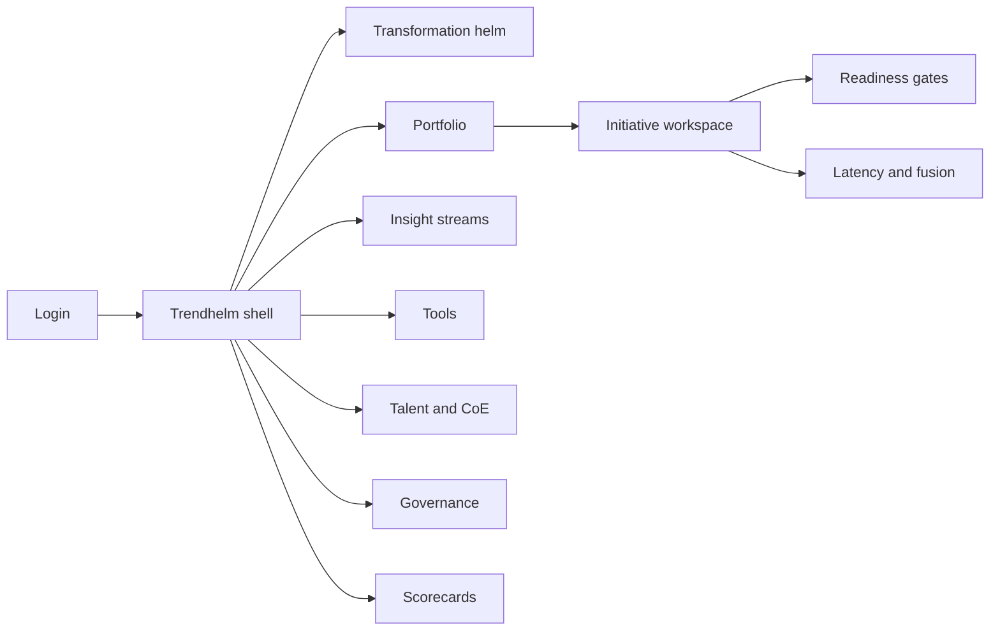
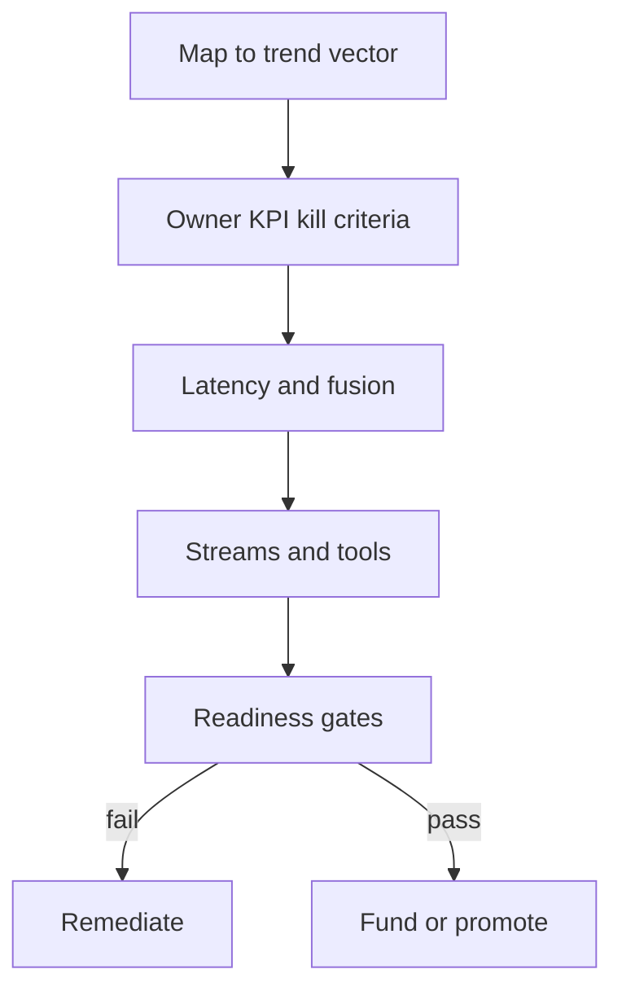

# Trendhelm — Web app

**Product:** [PRODUCT.md](./PRODUCT.md)
**Primary surface:** Intelligent-enterprise analytics OS (CDO / CIO programme console)
**Secondary surfaces:** Board transformation scorecard export; CoE intake capacity view (read-mostly)
**Design thesis:** Trendhelm is a two-year countdown operating room for analytics transformation — not another BI catalog. The UI metaphor is a trend portfolio helm: eight named vectors as a fixed compass, each initiative a plot with latency mode, kill criteria, and readiness gates. Visual language is deep navy ground with signal-chartreuse for on-window adoption and countdown-coral as the digital window burns down. Insight streams from outside the four walls appear as contracted channels, never as fake warehouse tables — access-vs-ownership is a visible chrome distinction on every data dependency.

## UX research synthesis

### Category peers (best-in-class)

- **ThoughtSpot / Tableau Pulse:** Conversational and augmented analytics measured by who asked and what answered. Steal: monthly active employees and decision coverage as adoption metrics (not “feature on”); reject embedding full BI exploration as Trendhelm’s home.
- **Collibra / Alation:** Data marketplace with ownership and contract semantics. Steal: external insight-stream contracts with purpose/retention/quality caveats; reject treating all assets as owned catalog entries.
- **Productboard + Planview hybrid pattern:** Outcome-linked portfolio with kill/merge. Steal: trend-vector mapping and explicit kill criteria on every bet; reject roadmap-only storytelling without two-year window pressure.
- **LeanIX application portfolio:** Tool retain/merge/sunset with overlap detection. Steal: consolidation decisions as first-class objects; reject CMDB sprawl as the CDO home.

### Patterns to adopt / reject

- **Adopt:** Eight-vector portfolio; latency/fusion declarations; conversational adoption (MAE + decision coverage); augmented readiness gates (DQ/bias); insight-stream contracts; tool sunset ledger; DSA talent demand vs supply; edge locality decisions; AI instruction audit with override; two-year scorecard.
- **Reject:** Trends-as-blog homepage; dashboard-of-everything; tool-feature checklists without owners; promoting AutoML without DQ gates; shadow tools without sunset status; purple “intelligent enterprise” marketing chrome.

### Trust, density, and workflow constraints from PRODUCT.md

Board packs must compress to the two-year window (BR-10) without dumping raw datasets into Trendhelm (trust boundary). External streams need contracts (BR-7). AI instructions to frontline need attribution and override (BR-11). Augmented below DQ threshold cannot promote (BR-4). Talent shortage is a named risk visible on the roadmap (BR-5, BR-9). Consolidation must be business-visible (BR-6).

## Information architecture

### Nav model

### Roles → default home

| Role | Default home | Why |
|------|--------------|-----|
| CDO / CIO | Transformation helm | Two-year window narrative (BR-10) |
| Analytics product owner | Portfolio → my initiatives | Latency, adoption, gates (BR-2–BR-4) |
| BI / IS platform lead | Tools | Retain/merge/sunset (BR-6) |
| Talent partner / CoE lead | Talent and CoE | Demand vs capacity (BR-5, BR-9) |
| Risk / compliance | Governance — instruction audit | Override and attribution (BR-11) |
| Procurement | Insight streams / IaaS compare | Take-rate and data rights (BR-12) |

### Cross-links to OpenAPI resources

| Nav area | OpenAPI tags / resources |
|----------|---------------------------|
| Portfolio / initiatives / gates | Portfolio |
| Insight streams | InsightStreams |
| Tools / consolidation | Tools |
| Talent forecasts | Talent |
| Instruction events | Governance |
| Executive scorecards | Scorecards |

## Screen inventory

### Transformation helm

- **Purpose:** Answer “are we closing the two-year window?” with leading adoption and lagging outcomes in one composition.
- **Entry:** Default for CDO/CIO.
- **Layout regions:** Brand + countdown clock; eight-vector compass with initiative density; adoption strip (conversational MAE, fusion coverage, contracted stream %); capacity warnings; alerts (gate fails, sunsets overdue).
- **Primary actions:** Open vector drill; publish scorecard; reallocate funding cue.
- **Empty / loading / error:** Empty = map first initiative to a trend vector; loading = skeleton compass; error = retry with request id.
- **BR / story ties:** BR-1, BR-10.

### Portfolio list

- **Purpose:** Living register of initiatives mapped to the eight vectors with owners, stages, kill/merge criteria.
- **Entry:** Nav → Portfolio.
- **Layout regions:** Filter by vector/stage/latency; table with KPI, funding stage, kill criteria summary; merge candidates.
- **Primary actions:** Create initiative; kill/merge; open workspace.
- **Empty / loading / error:** Empty = vector starter templates.
- **BR / story ties:** BR-1.

### Initiative workspace

- **Purpose:** Single operating record: vector, KPIs, latency, tools, streams, talent demand, gates, instruction policy.
- **Entry:** From portfolio or helm.
- **Layout regions:** Header (vector, owner, stage); outcome KPIs; latency profile; dependencies (owned vs contracted); tool footprint; talent/CoE load; readiness gate status; kill criteria panel.
- **Primary actions:** Advance stage; run gates; record kill/merge; attach override path.
- **Empty / loading / error:** Incomplete latency or kill criteria = blocking banner.
- **BR / story ties:** BR-1, BR-2, BR-8, BR-11.

### Latency and fusion designer

- **Purpose:** Declare batch / near-real-time / real-time / predictive and prove historical baseline pairing before live.
- **Entry:** Initiative → Latency.
- **Layout regions:** Mode selector; baseline pairing checklist; retail/IoT-style fusion example cues; go-live block if unpaired.
- **Primary actions:** Save profile; request fusion review.
- **Empty / loading / error:** Real-time without baseline = cannot promote.
- **BR / story ties:** BR-2.

### Readiness gates

- **Purpose:** Enforce DQ/bias for augmented, contract completeness for streams, override path for AI instructions.
- **Entry:** Initiative → Gates; promotion CTA.
- **Layout regions:** Gate checklist with scores; remediation links; pass/fail history.
- **Primary actions:** Re-run gate; grant audited exception.
- **Empty / loading / error:** Below threshold = coral block on production promote.
- **BR / story ties:** BR-4, BR-7, BR-11.

### Conversational / augmented adoption

- **Purpose:** Measure NL/voice and augmented as employee reach and decision coverage, not feature flags.
- **Entry:** Initiative metrics tab; helm adoption strip drill.
- **Layout regions:** MAE chart; decision coverage; segment targets; bias/DQ readiness for augmented.
- **Primary actions:** Sync usage telemetry; adjust targets.
- **Empty / loading / error:** No telemetry = “connect BI/NL source” empty state.
- **BR / story ties:** BR-3, BR-4.

### Insight streams registry

- **Purpose:** Access contracts for outside-the-walls streams vs owned assets — Ray Wang access-vs-ownership made operational.
- **Entry:** Nav → Insight streams.
- **Layout regions:** Stream table (provider, purpose, retention, quality caveats, take-rate); owned vs access chrome; substitutability notes.
- **Primary actions:** Create contract; compare IaaS offers; link to initiatives.
- **Empty / loading / error:** Uncontracted stream used by initiative = policy breach banner.
- **BR / story ties:** BR-7, BR-12.

### Tool consolidation

- **Purpose:** Inventory overlap; record retain / merge / sunset so shadow analytics cannot silently return.
- **Entry:** Nav → Tools.
- **Layout regions:** Inventory; overlap clusters; decision log with business impact; sunset schedule.
- **Primary actions:** Propose consolidation; approve sunset; notify owners.
- **Empty / loading / error:** Empty inventory = import from CMDB/SaaS spend.
- **BR / story ties:** BR-6.

### Talent and CoE capacity

- **Purpose:** DSA demand vs hire/upskill/retain and CoE load on roadmap items.
- **Entry:** Nav → Talent.
- **Layout regions:** Demand forecast by function; upskill programmes; CoE capacity vs intake; criticality flags.
- **Primary actions:** Adjust forecast; link upskill; block overloaded CoE intake.
- **Empty / loading / error:** No HRIS link = manual forecast mode warning.
- **BR / story ties:** BR-5, BR-9.

### Edge and video controls

- **Purpose:** Central vs edge processing decision and network/latency risk before scale funding.
- **Entry:** Initiative when vector is edge/video.
- **Layout regions:** Locality decision; device/stream scale estimate; risk note; scale-out gate.
- **Primary actions:** Record locality; request scale funding.
- **Empty / loading / error:** Missing locality = scale funding blocked (BR-8).
- **BR / story ties:** BR-8.

### Instruction audit (governance)

- **Purpose:** Attribute ai-assisted frontline instructions to initiative + model/rule version + human override path.
- **Entry:** Nav → Governance.
- **Layout regions:** Event ledger; override rate; missing-override blockers; export for compliance.
- **Primary actions:** Inspect event; enforce override path on initiative.
- **Empty / loading / error:** Empty = “no AI instructions yet” healthy state.
- **BR / story ties:** BR-11.

### Executive scorecards

- **Purpose:** Publish board packs: two-year progress, leading adoption, lagging outcomes.
- **Entry:** Nav → Scorecards; helm publish CTA.
- **Layout regions:** Scorecard drafts; window progress; linked initiative outcomes; export controls.
- **Primary actions:** Publish; schedule board pack; freeze version.
- **Empty / loading / error:** Incomplete metrics = cannot publish.
- **BR / story ties:** BR-10.

## Key flows

1. **Stand up a trend initiative** — map vector → set owner/KPI/kill criteria → declare latency → attach streams/tools → pass gates → fund; failure: unpaired real-time or failed DQ gate.

2. **Contract an external insight stream** — register provider → purpose/retention/caveats → disclose take-rate → link initiatives (BR-7, BR-12).

3. **Consolidate shadow tools** — detect overlap → retain/merge/sunset decision → business-visible impact → prevent silent return (BR-6).

4. **Two-year scorecard publish** — pull adoption + outcomes → CDO review → publish board pack (BR-10).

5. **AI instruction with override** — initiative declares override path → instruction event logged → override or audit exception (BR-11).

## Design system

### Tokens (CSS variables)

- `--color-ink: #E6EDF5` — text on dark ground
- `--color-navy-950: #0A1220` — app ground
- `--color-navy-900: #121C2E` — panels
- `--color-rule: #2A3A52` — dividers
- `--color-chartreuse: #A8D43A` — on-window / adoption healthy
- `--color-coral: #E85D4C` — countdown pressure / gate fail / fund block
- `--color-amber: #E0A83A` — provisional / capacity warning
- `--color-steel: #8AA0B8` — secondary labels
- `--color-brand: #A8D43A` — Trendhelm mark accent on navy
- `--font-display: "Space Grotesk", sans-serif` — helm titles and countdown
- `--font-body: "IBM Plex Sans", sans-serif` — tables and forms
- `--font-mono: "IBM Plex Mono", monospace` — contract ids, instruction event ids
- `--space-1`…`--space-8`: 4px scale
- `--radius-sm: 4px`; `--radius-md: 8px`
- `--motion-countdown: 300ms ease-in-out` — window meter tick
- `--motion-gate: 200ms ease-out` — gate pass/fail
- `--motion-vector: 220ms ease-out` — compass segment highlight
- Atmosphere: faint radar-grid on navy; soft vignette; no stock skyline “digital transformation” photos.

### Typography & brand

- Grotesk display for helm and countdown; Plex for dense portfolio; mono for contracts and audit ids.
- Brand wordmark left in shell on every programme view; login: brand + “Close the two-year analytics window” + one CTA.

### Do / don’t

- **Do:** Show access vs owned chrome on streams; require kill criteria; measure conversational by MAE; block low-DQ augmented promote; keep sunset decisions append-only.
- **Don’t:** Purple AI gradients; trends blog as home; BI chart walls without owners; hide external data as warehouse tables; emoji maturity badges.

### Accessibility & domain trust cues

- Countdown and gate states use text + icon + colour.
- Live regions for gate failures and scorecard publish.
- Instruction audit focuses keyboard users on override path fields first.
- Contrast AA+ for chartreuse/coral on navy.

## Component patterns

- **TrendVectorCompass** — eight-vector density map.
- **TwoYearCountdown** — window progress meter.
- **LatencyFusionPanel** — mode + baseline pairing.
- **InsightStreamContractRow** — access vs owned with caveats.
- **ToolSunsetLedger** — retain/merge/sunset decisions.
- **AugmentedReadinessGate** — DQ/bias scores with promote block.
- **ConversationalAdoptionStrip** — MAE + decision coverage.
- **CoECapacityBar** — load vs intake.
- **InstructionAuditEvent** — attribution + override.
- **BoardScorecardExport** — frozen pack version.

## Out of scope for v1 web

- Full BI authoring or conversational query engine; data lake compute; HRIS payroll; native edge device apps; vendor marketplace storefront; multi-tenant consulting white-label; headset/AR clients.
